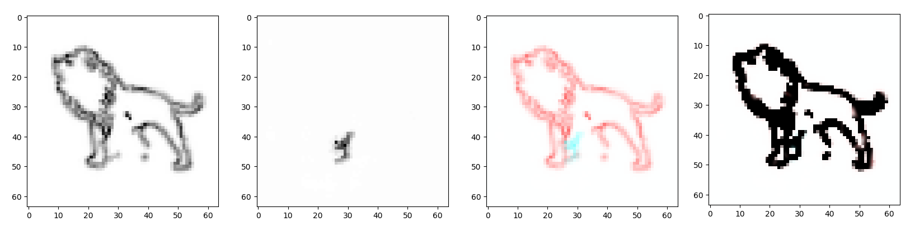

# IU Sketch  
##### (나(I)와 너(U, AI)가 친구처럼 스케치)  

By [김유성], [김현우], [이지수]  

AIFFEL 인천 3기. 오고고 팀  

### Table of Contents  
0. [Introduction](#introduction)  
0. [Dataset](#dataset)  
0. [Models](#models)  
0. [Results](#results)  
0. [References](#references)  
 

### Introduction  
아이와 같이 그림을 그리는 스케치 친구(IU-Sketch)를 만들자.  
◾ 비디오 예측 모델의 기반 기술에 대한 이해도를 높임.  
◾ 파이썬의 UI 및 여러가지 라이브러리 사용.  
◾ 학습 데이터는 크롤링을 통하여 쉽게 구할 수 있음.  

### Dataset  
사자 스케치 이미지를 따라그린 gif파일.  
◾gif형태의 비디오 프레임  
◾5D Tensor(batch, time_step, height, width, channel)로 변환  

### Models  
Pix2Pix의 GAN모델 사용.  
◾Encoder - Decoder  
◾Discriminator with ADA  

### Results  
  

### References.  
0. Pix2Pix Paper: https://arxiv.org/pdf/1611.07004.pdf  
0. ADA paper : https://arxiv.org/abs/2006.06676  

